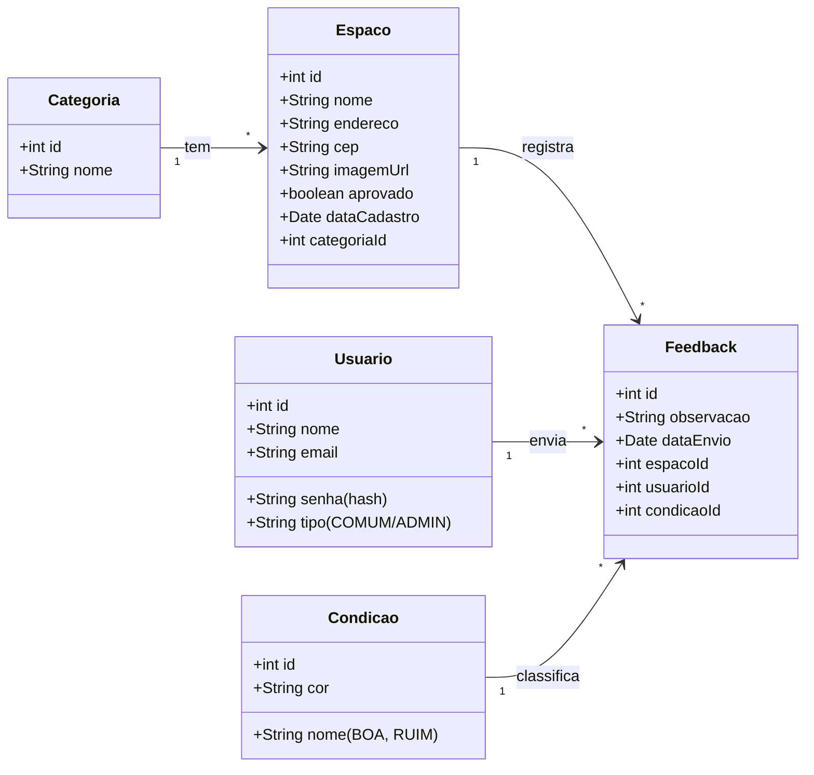

# 🏟️ Sampa Play: O Canvas do App Colaborativo em Markdown

Este documento apresenta o Business Model Canvas do Sampa Play, um aplicativo móvel colaborativo projetado para transformar a experiência de uso de espaços públicos de lazer em São Paulo. A estrutura a seguir detalha a arquitetura técnica e o modelo de negócio, alinhados aos critérios do Empreenda.

---

### 1. Proposta de Valor & Segmentos de Clientes

#### 🎯 Proposta de Valor
O Sampa Play transforma espaços públicos subutilizados, como quadras e academias ao ar livre, em locais de lazer seguros e confiáveis. Nossa plataforma centraliza informações sobre a **condição e segurança** desses locais, utilizando dados fornecidos de forma colaborativa pelos próprios usuários. Ao fazer isso, resolvemos a incerteza e a insegurança que impedem os cidadãos de aproveitarem os recursos de sua própria cidade.

#### 👥 Segmentos de Clientes
* **Cidadãos de São Paulo:** Pessoas que buscam locais gratuitos para praticar esportes e atividades físicas, mas se sentem inseguras ou desinformadas sobre as condições dos espaços.
* **Grupos de Amigos e Times Amadores:** Coletivos que precisam encontrar e avaliar espaços adequados para seus encontros e jogos.
* **Prefeitura e Subprefeituras:** Órgãos públicos que podem utilizar os dados agregados para direcionar manutenções e melhorias de forma mais eficiente.

#### 🌱 Alinhamento com os Objetivos de Desenvolvimento Sustentável (ODS)
O projeto contribui diretamente para:
* **ODS 3 (Saúde e Bem-Estar):** Ao incentivar a prática de atividades físicas em locais acessíveis e seguros.
* **ODS 11 (Cidades e Comunidades Sustentáveis):** Ao promover a apropriação e o cuidado com os espaços públicos, tornando a cidade mais resiliente e inclusiva.

---

### 2. Arquitetura e Estrutura Técnica

#### 🏗️ Arquitetura: Monolito Modular
A aplicação foi desenvolvida seguindo uma arquitetura de **Monolito Modular**. Essa abordagem nos permite manter a simplicidade de um único projeto (monolito) enquanto organizamos o código em módulos com responsabilidades bem definidas (ex: autenticação, espaços, feedback). Isso facilita a manutenção e prepara o terreno para uma futura migração para microserviços, se necessário.

#### 💻 Stack de Tecnologias
* **Linguagem:** O aplicativo é desenvolvido nativamente em **Kotlin**, a linguagem oficial para Android, garantindo performance e segurança.
* **Comunicação com API:** Utilizamos a biblioteca **Retrofit 2** para realizar chamadas de rede de forma eficiente e organizada. A comunicação com o backend segue o padrão RESTful.
* **Backend (MVP):** Atualmente, o backend é composto por uma API em **PHP com um banco de dados MySQL**.
* **Backend (Futuro):** Planejamos uma migração estratégica para **Spring Boot** para maior escalabilidade, segurança e robustez.
* **Listagem de Dados:** A exibição de listas é feita com o componente **RecyclerView**, otimizado para performance e reciclagem de views.
* **Respostas de API:** Requisições bem-sucedidas que não necessitam de um corpo de resposta, como um `DELETE`, retornam o status **HTTP 204 No Content**, seguindo as boas práticas de desenvolvimento de APIs.

#### 📊 Diagrama de Classes (Mermaid)
O diagrama abaixo representa a estrutura de classes e seus relacionamentos no banco de dados.

---

### 3. Canais, Receita e Status Atual

#### 📢 Canais
* **Principal:** Lojas de aplicativos (Google Play Store).
* **Divulgação:** Redes sociais focadas em comunidades de bairro e grupos esportivos, parcerias com influenciadores locais.

#### 💰 Fontes de Receita
O modelo de negócio adotado é o **Freemium**.
* **Gratuito:** Funcionalidades essenciais de busca, visualização e envio de feedback.
* **Premium (Futuro):** Agendamento de horários em quadras, criação de eventos fechados, filtros avançados e remoção de anúncios.
* **Parcerias:** Colaboração com a prefeitura para fornecimento de dados anonimizados e com empresas locais para publicidade direcionada.

#### 🚧 Status Atual do Projeto (MVP)
O projeto encontra-se em fase de desenvolvimento do MVP, com os seguintes marcos concluídos:
* **Telas:** As 5 telas obrigatórias estão implementadas: Login, Cadastro de Usuário, Tela de Busca/Listagem, Tela de Consulta de Espaço e Sobre Nós.
* **CRUD:** As operações de CRUD (Create, Read, Update, Delete) para os espaços estão codificadas no backend (PHP/MySQL) e na interface do serviço com Retrofit.
* **Funcionalidade:** A listagem de espaços a partir da API está funcional, com os dados sendo exibidos corretamente na **RecyclerView**.
* **Edição e Inclusão:** A lógica de preservação de dados ao rotacionar a tela ou navegar entre apps já foi implementada nas telas de edição e inclusão, garantindo uma boa experiência do usuário.

---

### 4. Mídia do Projeto

*Logo e fluxo de Telas*

| **Logo do Projeto** | 
| :------------------------------: | 
|  | 

| **Figma** | 
| :------------------------------: | 
|   \ | 

